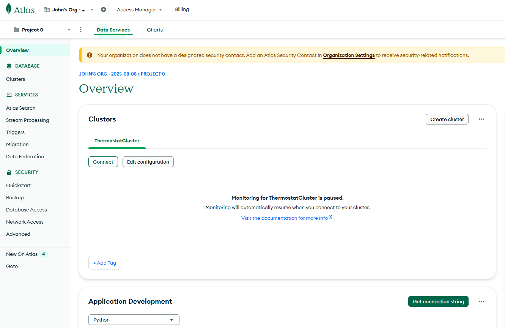
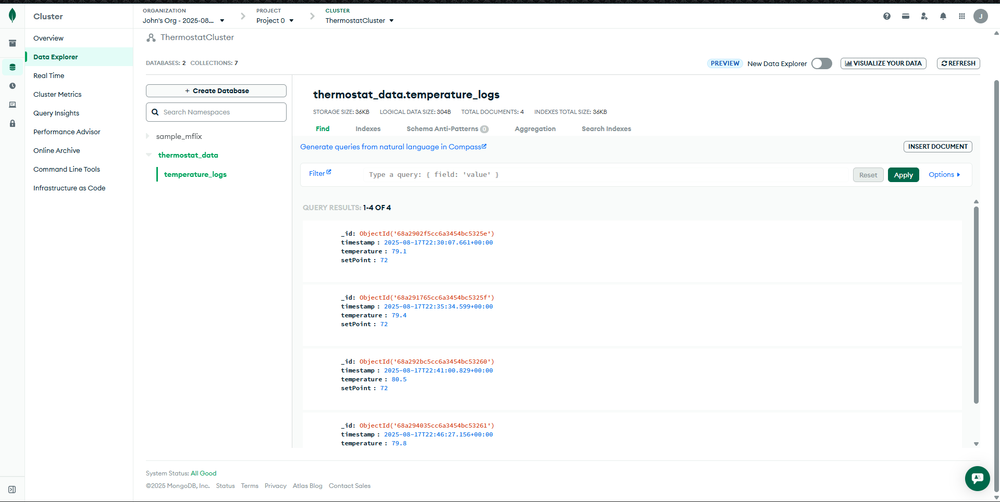

# Professional Self-Assessment

Throughout my Computer Science program, I have developed the technical knowledge, problem-solving ability, and professional skills necessary to succeed as a software engineer. This ePortfolio represents the culmination of that growth and highlights my ability to design, analyze, and enhance software systems in alignment with industry expectations.

One of the primary artifacts showcased in this portfolio is my work on a thermostat functionality project, which demonstrates my ability to integrate hardware, software, and data management concepts. The project began as a simple embedded system designed to display temperature readings and toggle between Celsius and Fahrenheit. Over time, I enhanced the system by introducing modular software design, implementing a state machine to manage transitions, and applying a PID controller with hysteresis logic to improve temperature stability. These enhancements reflect my growth in software engineering and algorithm design, as well as my ability to analyze problems and improve solutions through iteration.

In addition to improving the core control logic, I extended the project to incorporate database functionality by creating a MongoDB interface. This allowed the system to log and store historical temperature data, which could then be accessed and visualized through a web-based interface. This enhancement demonstrates my ability to design and implement database systems, build CRUD functionality, and connect embedded systems with full-stack applications. The integration of these components shows not only technical skill but also adaptability in bridging different areas of computer science.

My experiences with this project demonstrate alignment with the program’s course outcomes: the ability to design and engineer software solutions, apply algorithms and data structures effectively, work with databases, and communicate professional results. More importantly, the project highlights my capacity to identify areas of improvement, apply new techniques, and deliver tangible enhancements that increase functionality, efficiency, and user value.

This self-assessment reflects my readiness to apply my knowledge to real-world challenges. My work illustrates not only technical competency but also creativity, perseverance, and a commitment to continuous improvement. Moving forward, I will continue to refine these skills and apply them to projects that emphasize innovation, usability, and scalability within the field of computer science.

## Self Reflections

### - [Self-Introductions](Project_ePortfolio/CS 499 Module One Assignment.docx)

This paper will have my self introduction related to the computer science experience. It shares my view points and what I was planning to work on on my artifacts.

## Code Review

I perform a code review that shows what I wanted to work on and the functionality of the code by itself. It shows my planning of enhancements for the code and what I wanted to enhance.

## Software Design and Engineering Enhancement Narrative

### - [Milestone 2](Project_ePortfolio/Narrative Milestone 2 (1).docx)
### [Code](Project_ePortfolio/Thermostat_2.py)

This shows how I enhanced the code in a Design way, which was fixing all the comments, a few coding that needed polishing. This focuses on the enhancing of the code to reach a more fluid look.

## Algorithms and Data Structure Enhancement

### - [Milestone 3](Project_ePortfolio/Narrative Milestone 3.docx)
### [Code](Project_ePortfolio/Thermostat_3.py)

This shows my skills in using the pid and getting the code ready to be able to send information to a mongodb to collect on going information about what is happening in the system.

## Dataabses Enhancement

### - [Milestone 4](Project_ePortfolio/Narrative Milestone 4.docx)
### [Code](Project_ePortfolio/Thermostat_4.py)

This shows information on the database I worked on. While giving a narrative on what skills I worked on. This was the on I was most excited to working on. I was very glad I achieved connecting to the database and was able to send information from the raspberry pi to the mongodb.
